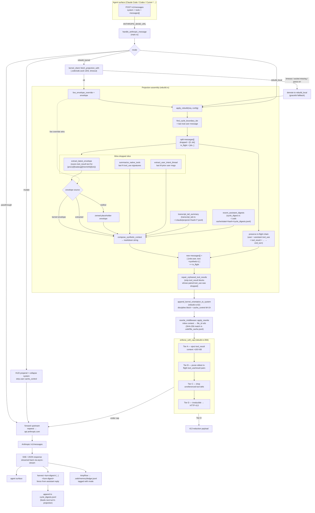
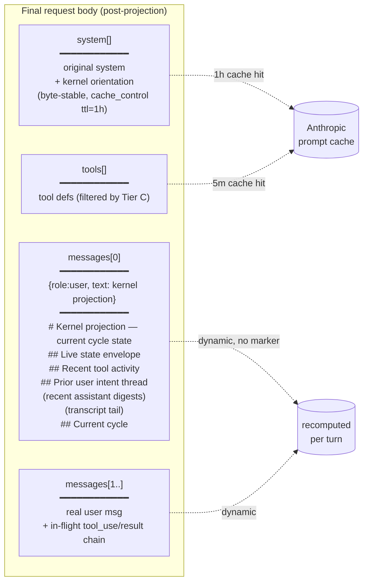
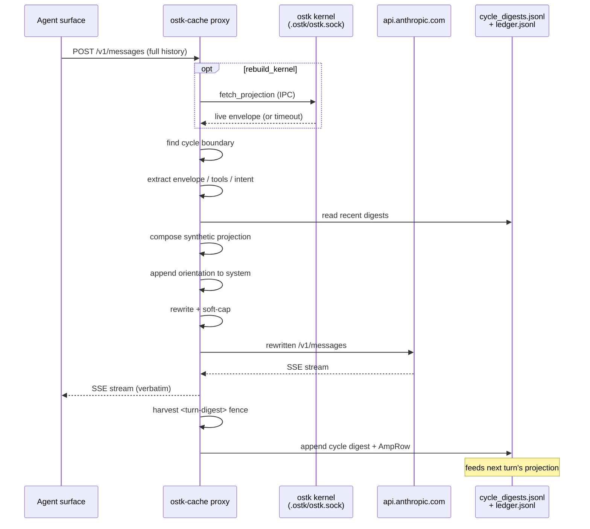

# Context projection in ostk-cache

This document maps how an incoming `/v1/messages` request body is
**projected** into the cache-friendly form forwarded upstream. The
projection is the heart of the `rebuild` / `rebuild-kernel` modes: it
replaces the entire prior-turn history with a synthesized markdown
**kernel projection** so the unchanging part of the request stays
byte-stable across turns and hits Anthropic's prompt cache.

## End-to-end flow



## Layered byte-stability strategy



The orientation block in the system tier is **firmware-class** —
byte-identical across every turn — so it carries the 1h cache breakpoint.
The synthetic projection itself is intentionally **not** cache-marked: its
envelope, tool list, and digests shift every turn, and Anthropic caps
`cache_control` markers at 4 per request, so the marker was better spent
on system.

## Mode divergence

```mermaid
flowchart TD
    M{"--mode"}
    M -->|passthrough| P["byte-identical forward<br/>(control baseline)"]
    M -->|mutate (default)| MU["legacy: HUD prepend +<br/>1h system cache +<br/>strip user cache_control"]
    M -->|rebuild| RL["rebuild_local<br/>envelope from tool_result text"]
    M -->|rebuild-kernel| RK["rebuild_kernel<br/>envelope from .ostk/ostk.sock"]
    RK -.->|kernel unreachable| RL
    RL --> COMMON["+ optional transcript tail<br/>+ recent assistant digests<br/>+ orientation in system<br/>+ rewrite + soft-cap"]
    RK --> COMMON
```

## Per-turn feedback loop



## Key code locations

| Concern | File:Function |
| --- | --- |
| HTTP entrypoint, mode dispatch | `src/main.rs::handle_anthropic_message` |
| Kernel IPC, fallback to local | `src/kernel_client.rs::fetch_projection_with` |
| Projection assembly | `src/rebuild.rs::apply_rebuild` (rebuild.rs:238) |
| Cycle boundary detection | `src/rebuild.rs::find_cycle_boundary_idx` (rebuild.rs:746) |
| Envelope extraction | `src/rebuild.rs::extract_latest_envelope` (rebuild.rs:781) |
| Tool summary | `src/rebuild.rs::summarize_native_tools` (rebuild.rs:887) |
| User intent thread | `src/rebuild.rs::extract_user_intent_thread` (rebuild.rs:997) |
| Final markdown composition | `src/rebuild.rs::compose_synthetic_context` (rebuild.rs:1156) |
| Orphan tool_result repair | `src/rebuild.rs::repair_orphaned_tool_results` (rebuild.rs:672) |
| Kernel orientation block | `src/rebuild.rs::append_kernel_orientation_to_system` (rebuild.rs:62) |
| File-handle rewrite | `src/rewrite_middleware.rs::apply_rewrite` |
| Soft-cap reduction (Tiers A–D) | `src/rebuild.rs::enforce_soft_cap` (rebuild.rs:394) |
| Transcript tail ingest | `src/transcript_tail.rs` |
| Turn-digest harvest + replay | `src/cycle_digest.rs` |
| Mode / option resolution | `src/config.rs` |
